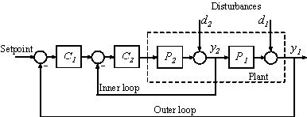

# Control en cascada

Se realiza [control](Control.md) en cascada cuando desea mejorarse la respuesta de un [Controlador PID](Controlador%20PID.md).
El diagrama del control en cascada es como el siguiente:

El controlador $C_1$ en la imagen se conoce como controlador primario o maestro, y el controlador $C_2$ se le conoce como secundario o esclavo. Como requisito, la respuesta y/o el muestreo del proceso secundario debe ser más rápido que el del control primario.
